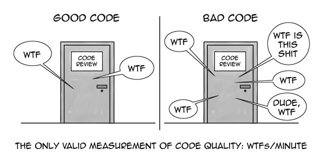

# CleanCodeMemento

## Table of contents :

1. [Presentation](#presentation-)
2. [Links](#links-)
3. [Uncle bob advices](#uncle-bob-advices)
4. [General](#general-)
5. [Functions](#functions-)
6. [Indenting](#indenting-)
7. [Objects](#objects-)
8. [Comments](#comments-)
9. [Javadoc](#javadoc-)
10. [Names](#names-)
11. [Personal advices](#personal-advices)
12. [Visitor advices](#visitor-advices)

## Presentation :

>The purpose of this memento is to help me become a better developer. There is some really obvious advices, but I'm sharing it here so there might be some beginners wanting to know how to Clean Code. I'll also probably share it in case I know someone wishing to code better. The first part is a bunch of advices taken from Uncle Bob's lessons on youtube. There is a personal notes part at the end, and in case you want to add a stone to the building you can participate at the end.

## Links :

- [Robert C. Martin's github](https://github.com/unclebob)
- [Clean Code book](https://www.amazon.fr/Clean-Code-Handbook-Software-Craftsmanship/dp/0132350882)
- [Cleancoder](http://cleancoder.com/products)
- [Youtube first lesson](https://www.youtube.com/watch?v=7EmboKQH8lM&ab_channel=UnityCoin)

# Uncle Bob advices

## General :

- Cleaning code is almost as long as making code work
- Sometimes, making code work is less important than doing clean code because no one will be able to help if no one understands it
- Avoid switch statements unless it's really easy to understand or won't need update 
- A module should be open for extension but closed for modification (Open Close principle)
- Use lambda expression to avoid side effects caused by pair function (open()/close() ...)
- If there is a try catch returning an exception, it should be in a seperate function
- Avoid code duplication
- It is more important your peers know how your code works, not the computer
- Learn about design patterns
- Readers should never scroll to the right to see the code

## Functions :

- The name of a function should always contain verbs
- Should be really small
- Around 3-15 lines
- One function does one thing
- It shouldn't be possible to extract another function if the function is clean
- Won't be lost in all these tiny function if you name it well
- Avoid more than 3 arguments
- Boolean should not be a function argument, it mean functions could be extracted from that function
- If it returns a value, it should not have side effects

## Indenting :

- One or two level of indentation maximum in a function 

## Objects :

- When a function needs several arguments, you should use objects
- Some switch statements can be replace by OOP

## Comments :

- Only use when the code doesn't explain itself
- Comments are good but don't abuse it
- Compensate our failure to make self-explaining code
- Try to make self-explaining code before using comments, using good variables and functions names ...
- Changing the basic color for comments might be a good idea so you don't ignore them on someone else code
- Design pattern can lead to necessary comments
- Can use TODO comments but
- Never forget to delete commented out code 
- Comment is always next to its subject

## Javadoc :

- Javadoc is cool unless the project is only seen by the developer team
- Don't use javadoc on each classes, functions if not needed. Indeed, javadoc automatism are enough for easy function or classes
- No HTML in javadoc

## Names :

- Good names never need comments
- Should be able to know what the variable contains just by reading its name
- The length of a variable name should depend on the scope (e.g : i for a loop, long variable name for a global one)
- It's the opposite for a function/class name, no one wants to call 50 times a long name function (e.g open())
- Distinguish names meaningfully
- Use names that you can pronounce for code review and pair programming

# Personal advices

- If a function returns a boolean and performs a test, its name should start by 'is'

# Visitor advices

- I have no friends :(
